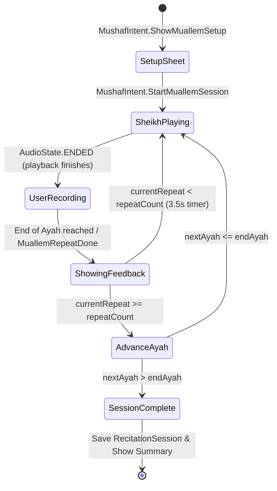

# Al-Mu'allem (المعلم - Repeat After the Sheikh) Feature Specification & Engineering Guide

## 1. Executive Summary & Feature Overview

The **Al-Mu'allem (المعلم)** feature in **Al-Mahir** is an interactive "repeat after the Sheikh" Quran recitation learning mode. It establishes a disciplined call-and-response cycle designed to help users master proper Quranic recitation, pronunciation (Tashkil), and Tajweed rules.

### Core Workflow
1. **Setup**: The user configures a target range (Surah, Start Ayah, End Ayah), repetition count per Ayah (1–10), and strictness level (`LENIENT`, `NORMAL`, `STRICT`).
2. **Sheikh Recitation (`SheikhPlaying`)**: The app streams audio of the target Ayah from the selected reciter and highlights words in sync.
3. **User Recitation (`UserRecording`)**: Upon audio completion, the microphone opens automatically. The app streams live PCM audio frames via WebSockets (`wss://`) to the remote AI engine for real-time grading.
4. **Instant Feedback (`ShowingFeedback`)**: After each attempt, word-by-word accuracy and mistake highlights (color + icon + text) are displayed for 3.5 seconds.
5. **Iteration & Auto-Advance**: Steps 2–4 repeat until the target repeat count for the Ayah is satisfied, after which the session automatically advances to the next Ayah in the range.

---

## 2. Architecture & Data Flow

Al-Mahir enforces strict **Clean Architecture** and **Unidirectional Data Flow (MVI)** per [`AGENTS.md`](../AGENTS.md).

```
┌───────────────────────────────────────────────────────────────────────────┐
│                          PRESENTATION LAYER                               │
│  MushafScreen ──(Intents)──> MushafViewModel ──(StateFlow)──> MushafUiState│
│        │                            │                                     │
│        └───────(Muallem UI)─────────┴──> MuallemSessionState / Phase      │
└─────────────────────────────────────┬─────────────────────────────────────┘
                                      │ (Use Cases)
┌─────────────────────────────────────▼─────────────────────────────────────┐
│                            DOMAIN LAYER                                   │
│  StartLiveRecitationUseCase  ·  GetTargetPageUseCase  · GetAyahTimingsUseCase│
│  SaveRecitationSessionUseCase ·  ObserveRecitationSettingsUseCase         │
└─────────────────────────────────────┬─────────────────────────────────────┘
                                      │ (Repository Interfaces)
┌─────────────────────────────────────▼─────────────────────────────────────┐
│                             DATA LAYER                                    │
│  LiveRecitationRepositoryImpl  <──> LiveRecitationSocket (Ktor + OkHttp)  │
│  AudioPlayer (ExoPlayer/Audio) <──> Quran CDN / Local Audio Cache         │
└───────────────────────────────────────────────────────────────────────────┘
```

### Layer Rules
- **`:mushaf:presentation`**: Contains `MushafScreen`, `MushafViewModel`, `MuallemSetupSheet`, `MuallemSessionBar`, `MuallemSessionState`. It depends **only** on `:mushaf:domain` and `:designsystem`.
- **`:mushaf:domain`**: Pure Kotlin entities (`RecitationStrictness`, `RecitationCursor`, `RecitationChunk`), use cases, and repository interfaces.
- **`:mushaf:data`**: Implements `LiveRecitationRepository`, owns `LiveRecitationSocket` and Ktor WebSocket engine client.

---

## 3. MVI State Machine & Lifecycle

### State Structures

#### `MuallemSessionState`
Tracks session parameters, current Ayah, repeat progress, and accumulated feedback:
- `surah: Int`, `currentAyah: Int`, `endAyah: Int`
- `difficulty: RecitationStrictness` (`LENIENT`, `NORMAL`, `STRICT`)
- `repeatCount: Int`, `currentRepeat: Int`
- `phase: MuallemPhase`
- `repeatFeedbacks: List<MuallemRepeatFeedback>` (feedbacks for current Ayah)
- `accumulatedFeedbacks: List<MuallemRepeatFeedback>` (feedbacks across completed Ayahs)

#### `MuallemPhase` (Sealed Interface)
```kotlin
sealed interface MuallemPhase {
    data object SheikhPlaying : MuallemPhase
    data class UserRecording(val repeatIndex: Int) : MuallemPhase
    data class ShowingFeedback(val repeatIndex: Int) : MuallemPhase
}
```

### Phase Transition Flowchart



---

## 4. Key Implementation Details in Code

### 4.1. Audio Playback & Auto Transition (`MushafViewModel.kt`)
When in `MuallemPhase.SheikhPlaying`, `playbackManager.audioState` is observed in `MushafViewModel`:

```kotlin
if (state == AudioState.ENDED
    && _state.value.mushafMode == MushafMode.MUALLEM
    && _state.value.muallemSession?.phase == MuallemPhase.SheikhPlaying
) {
    startMuallemRepeat()
}
```

### 4.2. Recording Phase & WebSocket Audio Streaming
`startMuallemRepeat()` opens the live socket via `startLiveRecitation(config, controls)`:
- Audio input is streamed as raw PCM chunks over WebSockets (`wss://`).
- Out-of-Ayah word rejection: The ViewModel enforces `expectedPrefix` (`"${surah}:${currentAyah}:"`) on incoming graded chunks to ignore accidental engine jumps outside the target verse.
- Auto end-of-verse detection: `shouldFinishMuallemRepeat()` checks `chunk.forcedCut` or if the engine cursor/matched end reaches `muallemAyahWordCount`.

### 4.3. Manual Stop & Teardown
`finishMuallemRepeat()` ensures low-latency mic release:
1. Dispatches `RecitationControl.Finish` to the socket.
2. Immediately cancels `muallemSessionJob` and closes `muallemControlChannel` to prevent user audio overflow into subsequent verses.
3. Advances to `MuallemPhase.ShowingFeedback`.

---

## 5. Networking, Authentication & Debugging Fixes

The AI Service WebSocket client configuration is defined in `mushaf/data/src/main/java/com/example/mushaf/data/core/di/MushafNetworkModule.kt`.

### 5.1. Low-Level OkHttp Interceptor (`403 Forbidden` / ngrok Fix)
Because Ktor's `defaultRequest` plugin does not inject headers during WebSocket HTTP upgrade handshakes, a native OkHttp `Interceptor` was configured in `aiOkHttpClient`:

```kotlin
val authInterceptor = Interceptor { chain ->
    val original = chain.request()
    val req = original.newBuilder()
        .addHeader("ngrok-skip-browser-warning", "true")
        .addHeader("Origin", "https://qualm-mountable-cultivate.ngrok-free.dev")
        .apply { if (token.isNotBlank()) addHeader("Authorization", "Bearer $token") }
        .build()
    chain.proceed(req)
}
```
`OkHttpClient.Builder().preconfigured(aiOkHttpClient)` is passed directly into Ktor's `OkHttp` engine.

### 5.2. Network Security Config & Trust Anchors
To prevent `SSLHandshakeException` on older Android emulators or devices missing Let's Encrypt root CAs (for `api.quran.com` and ngrok tunnels), debug security rules in `app/src/debug/res/xml/network_security_config.xml` explicitly trust both `system` and `user` certificate authorities.

---

## 6. Primary File Map & Directory Index

| Layer | Responsibility | File Path |
|---|---|---|
| **Presentation** | Main UI Screen & Pager | `mushaf/presentation/src/main/java/com/example/mushaf/presentation/MushafScreen.kt` |
| **Presentation** | MVI Reducer & State Machine | `mushaf/presentation/src/main/java/com/example/mushaf/presentation/MushafViewModel.kt` |
| **Presentation UI** | Setup Bottom Sheet | `mushaf/presentation/src/main/java/com/example/mushaf/presentation/muallem/MuallemSetupSheet.kt` |
| **Presentation UI** | Live Session Control Bar | `mushaf/presentation/src/main/java/com/example/mushaf/presentation/muallem/MuallemSessionBar.kt` |
| **Presentation State** | State & Phase Models | `mushaf/presentation/src/main/java/com/example/mushaf/presentation/muallem/MuallemSessionState.kt` |
| **Data (Network)** | AI Ktor/OkHttp Client DI | `mushaf/data/src/main/java/com/example/mushaf/data/core/di/MushafNetworkModule.kt` |
| **Data (Network)** | App-wide Ktor Network Module | `data/src/main/java/com/iti/data/core/di/NetworkModule.kt` |
| **Data (Socket)** | WebSocket Frame Pipeline | `mushaf/data/src/main/java/com/example/mushaf/data/recite/remote/LiveRecitationSocket.kt` |
| **Security Config** | Debug SSL Trust Anchors | `app/src/debug/res/xml/network_security_config.xml` |
| **Documentation** | Epic Feature Brief | `docs/features/07-muallem-repeat.md` |
| **Documentation** | Recent Testing Summary | `docs/muallem_feature_summary.md` |

---

## 7. Operational Guidelines for Agents

When implementing changes or debugging the Al-Mu'allem feature:
1. **Never bypass `MushafTheme` or hardcode dimension/color values** — adhere strictly to `:designsystem` tokens.
2. **Keep `MuallemPhase` state transitions atomic** in `MushafViewModel.kt`.
3. **Respect microphone permissions and pre-prompt flows** (`MicPromptDialog`) before initiating recording.
4. **Ensure low-level headers (`Origin`, `Authorization`, `ngrok-skip-browser-warning`)** remain attached to the OkHttp client in `MushafNetworkModule.kt`.
5. **Always log WebSocket frame exchanges and latencies** under the `AiServiceNet` and `MuallemLatency` tags for backend diagnostic traceability.
